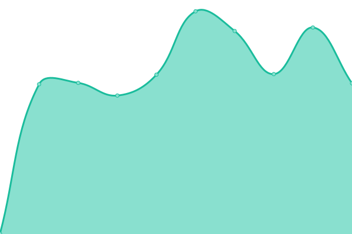
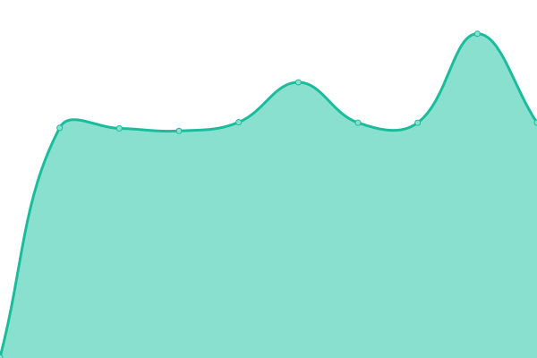
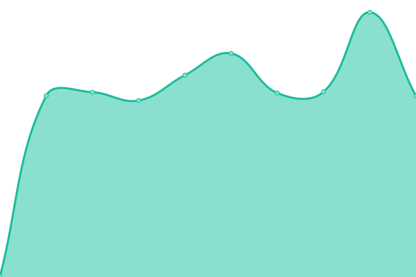
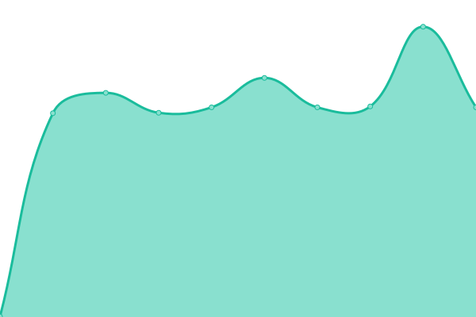
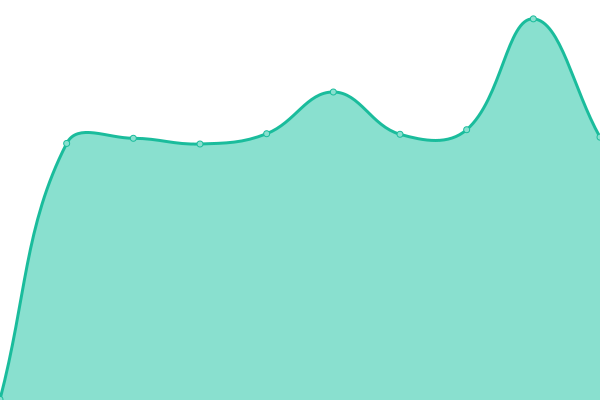
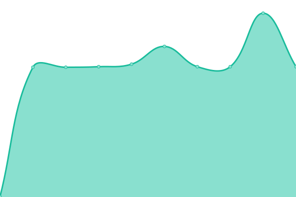
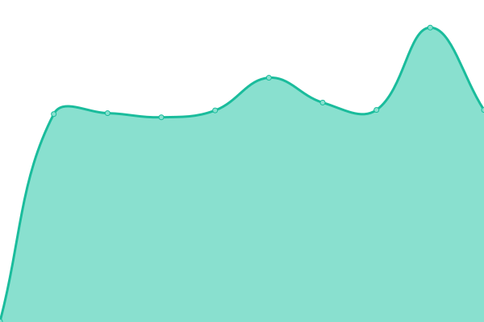

# [📈 Live Status](https://demo.upptime.js.org): <!--live status--> **🟩 All systems operational**

This repository contains the open-source uptime monitor and status page for [Toll](https://www.toll.no).

With [Upptime](https://upptime.js.org), you can get your own unlimited and free uptime monitor and status page, powered entirely by a GitHub repository. We use [Issues](https://github.com/toll/toll-api-status/issues) as incident reports, [Actions](https://github.com/toll/toll-api-status/actions) as uptime monitors, and [Pages](https://demo.upptime.js.org) for the status page.

<!--start: status pages-->
<!-- This summary is generated by Upptime (https://github.com/upptime/upptime) -->
<!-- Do not edit this manually, your changes will be overwritten -->
<!-- prettier-ignore -->
| URL | Status | History | Response Time | Uptime |
| --- | ------ | ------- | ------------- | ------ |
|  [MO - movement-road-api-v2](https://api.toll.no/api/movement/road/v2/swagger-ui/index.html) | 🟩 Up | [mo-movement-road-api-v2.yml](https://github.com/toll/toll-api-status/commits/HEAD/history/mo-movement-road-api-v2.yml) | 

 768ms
     
 | 

<a href="https://demo.upptime.js.org/history/mo-movement-road-api-v2">100.00%</a>
    

|  [MO - movement-road-query-api-v2](https://api.toll.no/api/movement/road/status/v2/swagger-ui/index.html) | 🟩 Up | [mo-movement-road-query-api-v2.yml](https://github.com/toll/toll-api-status/commits/HEAD/history/mo-movement-road-query-api-v2.yml) | 

 451ms
     
 | 

<a href="https://demo.upptime.js.org/history/mo-movement-road-query-api-v2">100.00%</a>
    

|  [MO - movement-air-api](https://api.toll.no/api/movement/air/v1/swagger-ui/index.html) | 🟩 Up | [mo-movement-air-api.yml](https://github.com/toll/toll-api-status/commits/HEAD/history/mo-movement-air-api.yml) | 

 470ms
     
 | 

<a href="https://demo.upptime.js.org/history/mo-movement-air-api">100.00%</a>
    

|  [MO - movement-air-query-api](https://api.toll.no/api/movement/air/status/v1/swagger-ui/index.html) | 🟩 Up | [mo-movement-air-query-api.yml](https://github.com/toll/toll-api-status/commits/HEAD/history/mo-movement-air-query-api.yml) | 

 465ms
     
 | 

<a href="https://demo.upptime.js.org/history/mo-movement-air-query-api">100.00%</a>
    

|  [MO - movement-rail-api](https://api.toll.no/api/movement/rail/v1/swagger-ui/index.html) | 🟩 Up | [mo-movement-rail-api.yml](https://github.com/toll/toll-api-status/commits/HEAD/history/mo-movement-rail-api.yml) | 

 455ms
     
 | 

<a href="https://demo.upptime.js.org/history/mo-movement-rail-api">100.00%</a>
    

|  [MO - movement-rail-query-api](https://api.toll.no/api/movement/rail/status/v1/swagger-ui/index.html) | 🟩 Up | [mo-movement-rail-query-api.yml](https://github.com/toll/toll-api-status/commits/HEAD/history/mo-movement-rail-query-api.yml) | 

 464ms
     
 | 

<a href="https://demo.upptime.js.org/history/mo-movement-rail-query-api">100.00%</a>
    

|  [MO - movement-presentation-api](https://api.toll.no/api/movement/presentation/v1/swagger-ui/index.html) | 🟩 Up | [mo-movement-presentation-api.yml](https://github.com/toll/toll-api-status/commits/HEAD/history/mo-movement-presentation-api.yml) | 

 453ms
     
 | 

<a href="https://demo.upptime.js.org/history/mo-movement-presentation-api">100.00%</a>
    

|  [MO - movement-routing-api](https://api.toll.no/api/movement/routing/v1/swagger-ui/index.html) | 🟩 Up | [mo-movement-routing-api.yml](https://github.com/toll/toll-api-status/commits/HEAD/history/mo-movement-routing-api.yml) | 

 453ms
     
 | 

<a href="https://demo.upptime.js.org/history/mo-movement-routing-api">100.00%</a>
    

<!--end: status pages-->

[**Visit our status website →**](https://demo.upptime.js.org)

## 📄 License

- Powered by: [Upptime](https://github.com/upptime/upptime)
- Code: [MIT](./LICENSE) © [Anand Chowdhary](https://anandchowdhary.com), supported by [Pabio](https://pabio.com)
- Data in the `./history` directory: [Open Database License](https://opendatacommons.org/licenses/odbl/1-0/)
